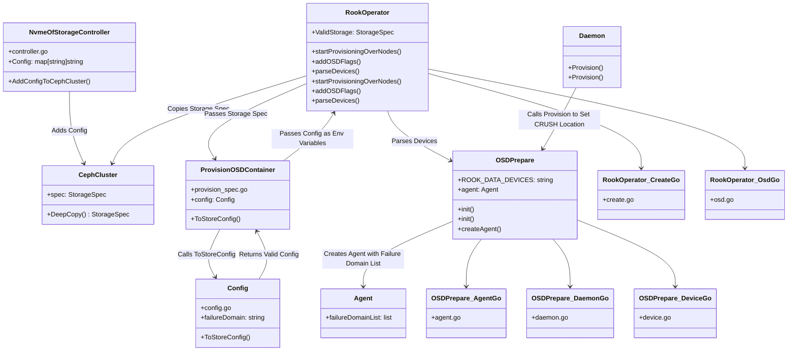

```mermaid
classDiagram
    class NvmeOfStorageController {
        +controller.go
        +Config: map[string]string
    }
    NvmeOfStorageController : +AddConfigToCephCluster()

    class CephCluster {
        +spec: StorageSpec
        +DeepCopy() StorageSpec
    }

    class RookOperator {
        +startProvisioningOverNodes()
        +ValidStorage: StorageSpec
        +addOSDFlags()
        +parseDevices()
    }
    RookOperator : +startProvisioningOverNodes()
    RookOperator : +addOSDFlags()
    RookOperator : +parseDevices()

    class ProvisionOSDContainer {
        +provision_spec.go
        +config: Config
    }
    ProvisionOSDContainer : +ToStoreConfig()

    class Config {
        +config.go
        +ToStoreConfig()
        +failureDomain: string
    }

    class OSDPrepare {
        +init()
        +ROOK_DATA_DEVICES: string
        +agent: Agent
    }
    OSDPrepare : +init()
    OSDPrepare : +createAgent()

    class Agent {
        +failureDomainList: list
    }

    class Daemon {
        +Provision()
    }
    Daemon : +Provision()

    NvmeOfStorageController --> CephCluster : Adds Config
    RookOperator --> CephCluster : Copies Storage Spec
    RookOperator --> ProvisionOSDContainer : Passes Storage Spec
    ProvisionOSDContainer --> Config : Calls ToStoreConfig
    Config --> ProvisionOSDContainer : Returns Valid Config
    ProvisionOSDContainer --> RookOperator : Passes Config as Env Variables
    RookOperator --> OSDPrepare : Parses Devices
    OSDPrepare --> Agent : Creates Agent with Failure Domain List
    Daemon --> OSDPrepare : Calls Provision to Set CRUSH Location

    %% Package grouping
    class RookOperator_CreateGo {
        +create.go
    }
    class RookOperator_OsdGo {
        +osd.go
    }
    RookOperator --> RookOperator_CreateGo
    RookOperator --> RookOperator_OsdGo

    class OSDPrepare_AgentGo {
        +agent.go
    }
    class OSDPrepare_DaemonGo {
        +daemon.go
    }
    class OSDPrepare_DeviceGo {
        +device.go
    }
    OSDPrepare --> OSDPrepare_AgentGo
    OSDPrepare --> OSDPrepare_DaemonGo
    OSDPrepare --> OSDPrepare_DeviceGo

```
