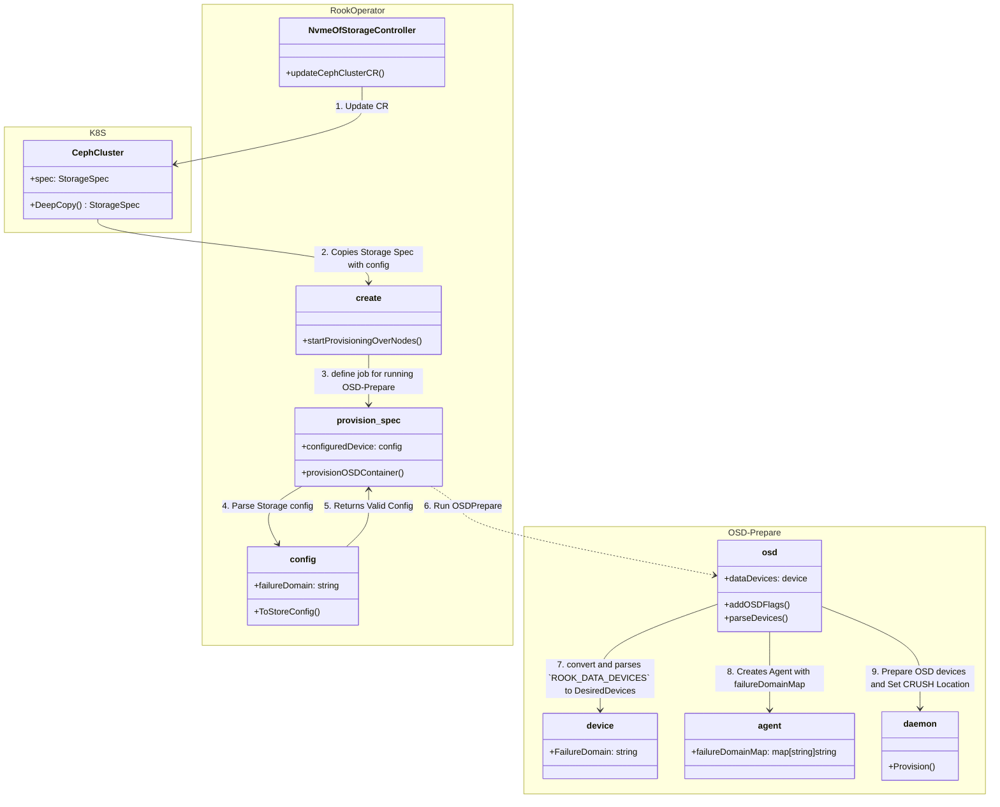

```mermaid
classDiagram
    namespace K8S {
        class CephCluster {
            +spec: StorageSpec
            +DeepCopy() StorageSpec
        }
    }
    namespace RookOperator {
        class NvmeOfStorageController {
            +updateCephClusterCR()
        }
        class create {
            +startProvisioningOverNodes()
        }
        class provision_spec {
            +provisionOSDContainer()
            +configuredDevice: config
        }
        class config {
            +ToStoreConfig()
            +failureDomain: string
        }
    }

    namespace OSD-Prepare {
        class device {
            +FailureDomain: string
        }
        class osd {
            +addOSDFlags()
            +parseDevices()
            +dataDevices: device
        }
        class agent {
            +failureDomainMap: map[string]string
        }
        class daemon {
            +Provision()
        }
    }


    NvmeOfStorageController --> CephCluster : 1. Update CR
    CephCluster --> create : 2. Copies Storage Spec with config
    create --> provision_spec: 3. define job for running OSD-Prepare
    provision_spec --> config: 4. Parse Storage config
    config --> provision_spec: 5. Returns Valid Config
    provision_spec ..>  osd: 6. Run OSDPrepare
    osd --> device : 7. convert and parses `ROOK_DATA_DEVICES` to DesiredDevices
    osd --> agent : 8. Creates Agent with failureDomainMap
    osd --> daemon : 9. Prepare OSD devices and Set CRUSH Location

```
