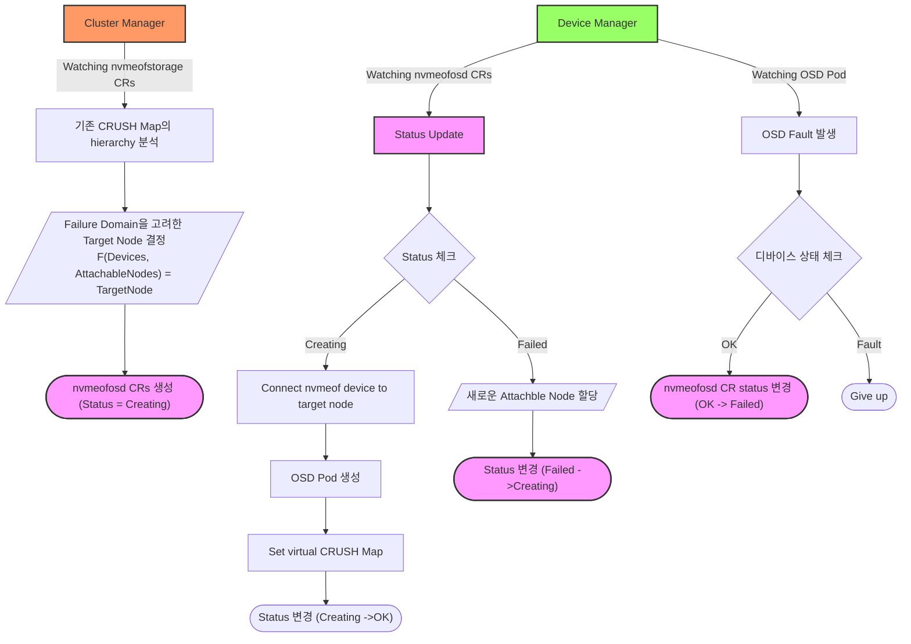

```mermaid
graph TD;
    1A[Cluster Manager] -->|Watching nvmeofstorage CRs| 1B[기존 CRUSH Map의 hierarchy 분석]
    1B --> 1C[/Failure Domain을 고려한 Target Node 결정\nF#40;Devices, AttachableNodes#41; = TargetNode/]
    1C --> 1D([nvmeofosd CRs 생성 #40;Status = Creating#41;])

    2A[Device Manager] --> |Watching nvmeofosd CRs| 2B[Status Update]
    2B --> 2C{Status 체크}
    2C --> |Creating| 2D[Connect nvmeof device to target node]
    2C --> |Failed| 2H[/새로운 Attachble Node 할당/]
    2D --> 2E[OSD Pod 생성]
    2E --> 2F[Set virtual CRUSH Map]
    2F --> 2G([Status 변경 #40;Creating ->OK#41;])

    2H --> 2I([Status 변경 #40;Failed ->Creating#41;])


    2A -->|Watching OSD Pod| 3A[OSD Fault 발생]
    3A --> 3B{디바이스 상태 체크}
    3B -->|OK| 3C([nvmeofosd CR status 변경 #40;OK -> Failed#41;])
    3B -->|Fault| 3D([Give up])

    style 1A fill:#f96,stroke:#333,stroke-width:2px
    style 2A fill:#9f6,stroke:#333,stroke-width:2px
    style 1D fill:#f9f,stroke:#333,stroke-width:2px
    style 2B fill:#f9f,stroke:#333,stroke-width:2px
    style 2I fill:#f9f,stroke:#333,stroke-width:2px
    style 3C fill:#f9f,stroke:#333,stroke-width:2px
```
<!--  -->
