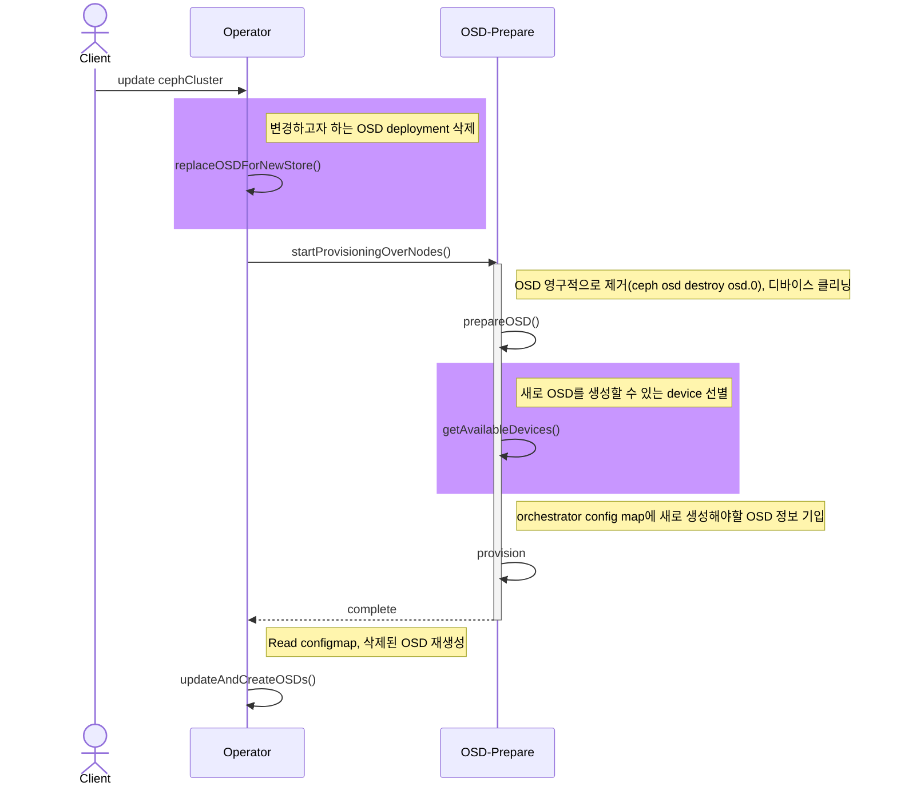

```mermaid
sequenceDiagram
    actor C as Client
    participant O as Operator
    participant P as OSD-Prepare

    C->>O: update cephCluster
    rect rgb(200, 150, 255)
    note right of O: 변경하고자 하는 OSD deployment 삭제
    O->>O: replaceOSDForNewStore()
    end
    O->>P: startProvisioningOverNodes()
    activate P
        note right of P: OSD 영구적으로 제거(ceph osd destroy osd.0), 디바이스 클리닝
        P->>P: prepareOSD()
        rect rgb(200, 150, 255)
        note right of P: 새로 OSD를 생성할 수 있는 device 선별
        P->>P: getAvailableDevices()
        end
        note right of P: orchestrator config map에 새로 생성해야할 OSD 정보 기입
        P->>P: provision
        P-->>O: complete
    deactivate P
    note right of O: Read configmap, 삭제된 OSD 재생성
    O->>O: updateAndCreateOSDs()
```
