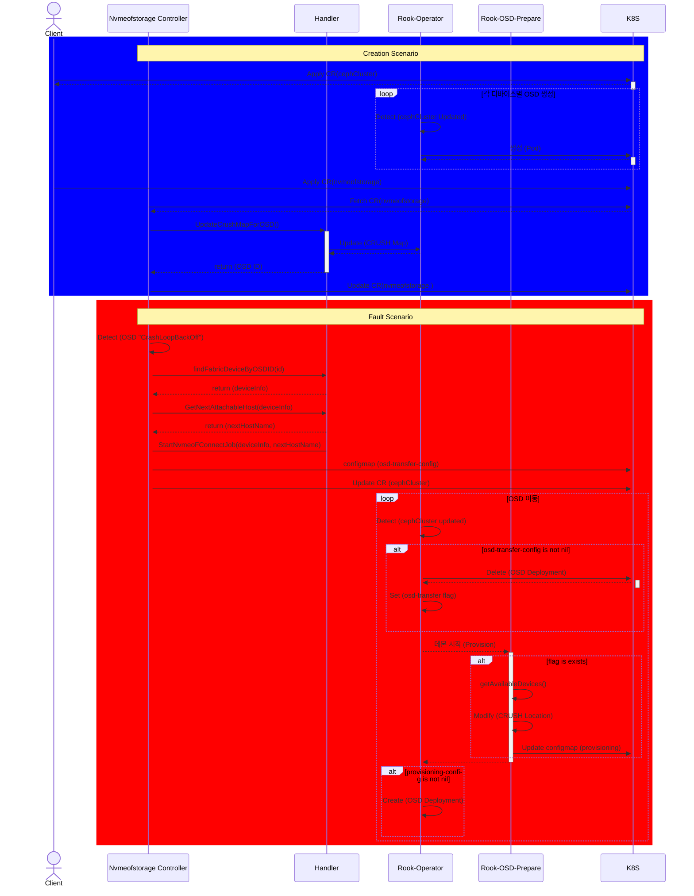

```mermaid
sequenceDiagram
    actor C as Client
    participant NVC as Nvmeofstorage Controller
    participant H as Handler
    participant R as Rook-Operator
    participant P as Rook-OSD-Prepare
    participant K as K8S

    rect rgb(0, 0, 255)
        Note over NVC,K: Creation Scenario

        C->>+K: Apply CR(cephCluster)
        K-->>-C:
        loop 각 디바이스별 OSD 생성
            R->>R: Detect (cephCluster Updated)
            R->>+K: 생성 (Pod)
            K-->>-R:
        end

        C->>+K: Apply CR(nvmeofstorage)
        NVC->>+K: Fetch CR(nvmeofstorage)
        K-->>+NVC:

        NVC->>+H: UpdateCrushMapForOSD()
        H->>R: Update (CRUSH Map)
        R-->>H:
        H-->>-NVC: return (OSD ID)
        NVC ->>K: Update CR(nvmeofstorage )
    end

    rect rgb(255, 0, 0)
        Note over NVC,K: Fault Scenario
        NVC->>+NVC: Detect (OSD "CrashLoopBackOff")

        NVC->>H: findFabricDeviceByOSDID(id)
        H-->>NVC: return (deviceInfo)

        NVC->>H: GetNextAttachableHost(deviceInfo)
        H-->>NVC: return (nextHostName)

        NVC->H: StartNvmeoFConnectJob(deviceInfo, nextHostName)
        NVC->>K: configmap (osd-transfer-config)
        NVC->>K: Update CR (cephCluster)

        loop OSD 이동
            R->>+R: Detect (cephCluster updated)

            alt osd-transfer-config is not nil
                R->>+K: Delete (OSD Deployment)
                K-->>-R:
                R->>R: Set (osd-transfer flag)
            end

            R-->>+P: 데몬 시작 (Provision)
            alt flag is exists
                P->>P: getAvailableDevices()
                P->>P: Modify (CRUSH Location)
                P->>K: Update configmap (provisioning)
            end
            P-->>-R:

            alt provisioning-config is not nil
                R->>R: Create (OSD Deployment)
            end
        end
    end

```
