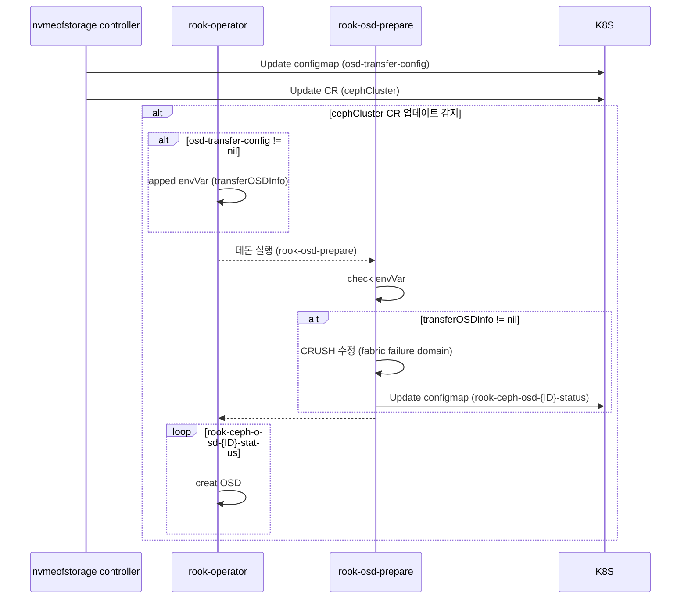

```mermaid
sequenceDiagram
    participant nvmeofstorage as nvmeofstorage controller
    participant rook_operator as rook-operator
    participant rook_osd_prepare as rook-osd-prepare
    participant K8S as K8S

    nvmeofstorage->>K8S: Update configmap (osd-transfer-config)
    nvmeofstorage->>K8S: Update CR (cephCluster)

    alt cephCluster CR 업데이트 감지
        alt osd-transfer-config != nil
            rook_operator->>rook_operator: apped envVar (transferOSDInfo)
        end

        rook_operator-->>rook_osd_prepare: 데몬 실행 (rook-osd-prepare)
        rook_osd_prepare->>rook_osd_prepare: check envVar
        alt transferOSDInfo != nil
            rook_osd_prepare->>rook_osd_prepare: CRUSH 수정 (fabric failure domain)
            rook_osd_prepare->>K8S: Update configmap (rook-ceph-osd-{ID}-status)
        end
        rook_osd_prepare-->>rook_operator:


        loop rook-ceph-osd-{ID}-status
            rook_operator->>rook_operator: creat OSD
        end
    end
```
